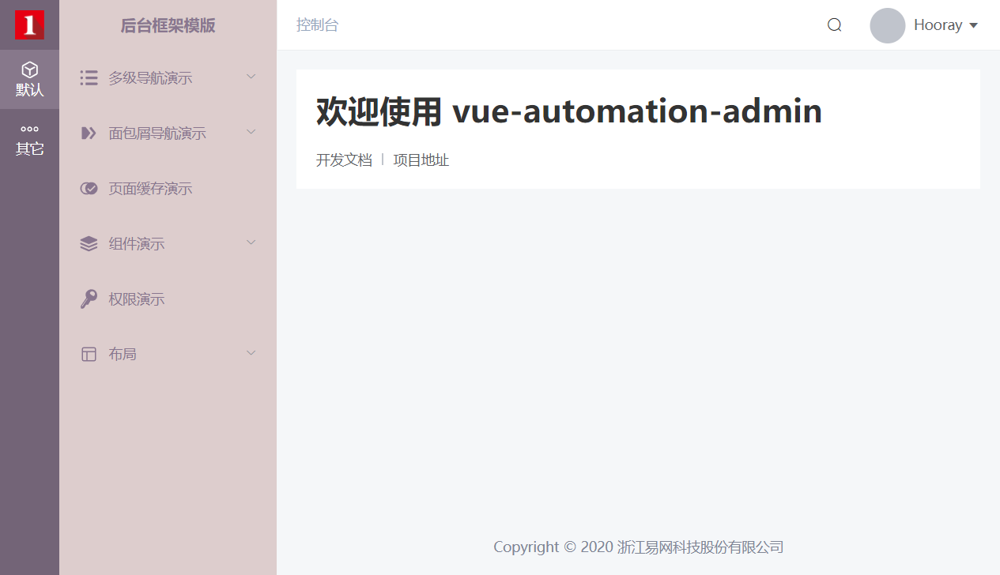
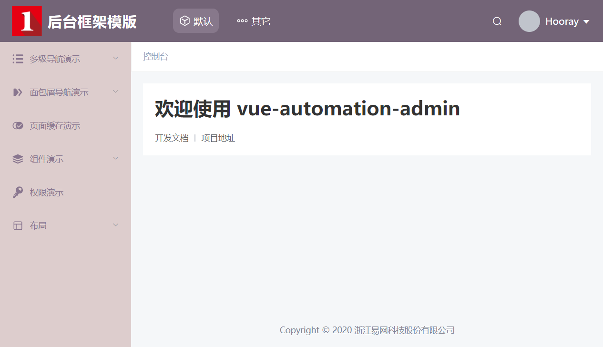
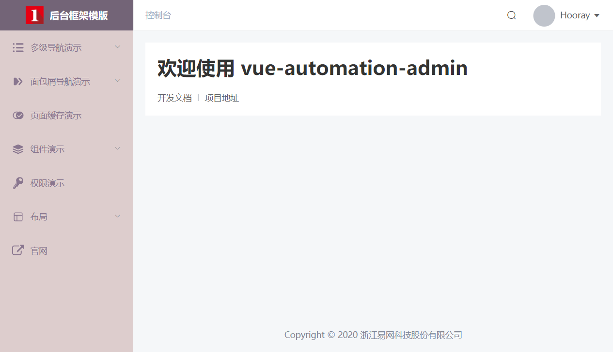
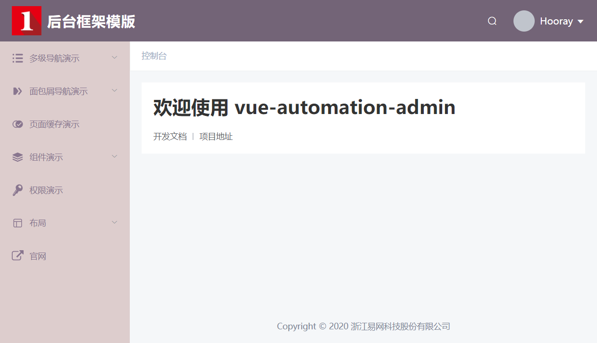
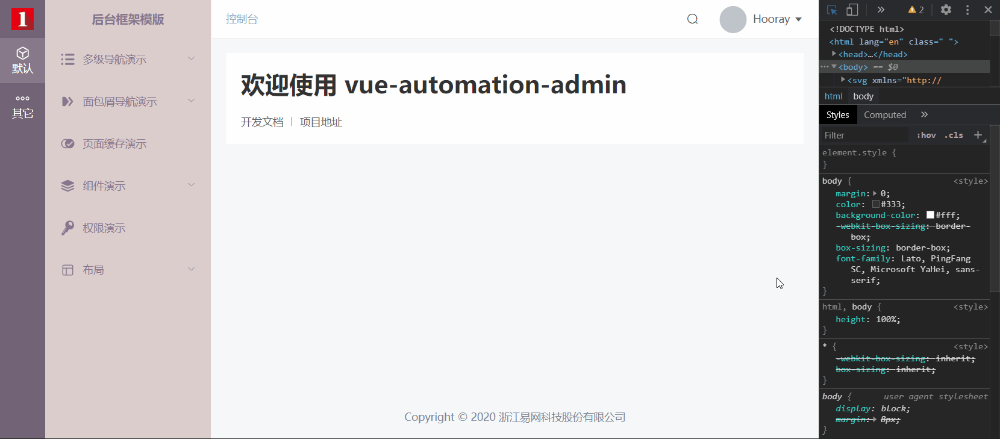
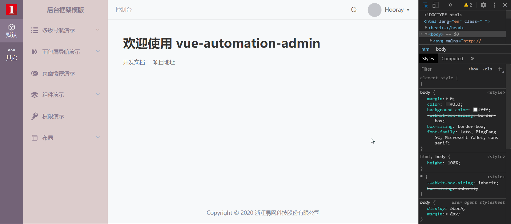
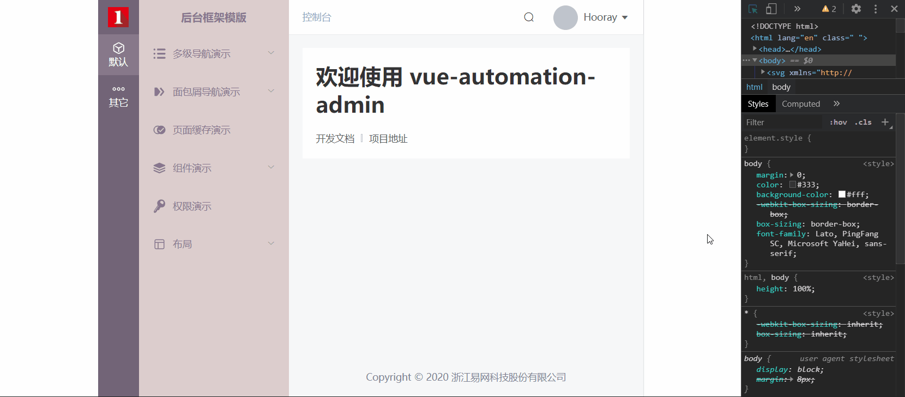
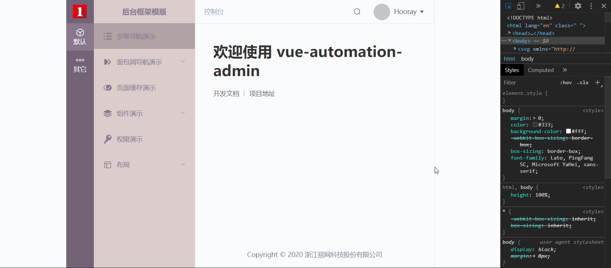

# 布局

布局分为两类，分别是 **导航布局** 和 **自适应/定宽布局** ，各自提供了 4 种模式，可以组合使用。通过组合搭配可以实现 16 种布局模式，覆盖市面上各种中后台布局。

下面均为单个布局模式的演示，组合使用请自行拉取代码在本地测试。

## 导航布局

模版提供了 4 种导航布局模式，下面分别介绍导航布局模式以及配置方式：

### 侧边栏带主导航模式（默认）



项目运行后，就能看到如上效果，无需进行任何配置。

### 头部带主导航模式



在 `src/setting.js` 里设置 `showHeader` 为 `true`：

```js
export default {
    // 是否显示头部
    showHeader: false
}
```

### 仅侧边栏模式



仅显示侧边栏，但不需要主导航，需要在 `src/router/index.js` 里设置 `asyncRoutes` ，当 `asyncRoutes` 的长度只有一项的时候，主导航则自动隐藏：

```js
let asyncRoutes = [
    {
        meta: {
            title: '默认',
            icon: 'sidebar-default'
        },
        children: [
            MultilevelMenuExample,
            BreadcrumbExample,
            KeepAliveExample,
            ComponentExample,
            PermissionExample,
            HeaderExample
        ]
    }
]
```

需要注意，如果 `asyncRoutes` 里有多项，但如果单项里的 `children` 为空，系统也不会算为多项。下面的配置主导航依旧自动隐藏：

```js
let asyncRoutes = [
    {
        meta: {
            title: '默认',
            icon: 'sidebar-default'
        },
        children: [
            MultilevelMenuExample,
            BreadcrumbExample,
            KeepAliveExample,
            ComponentExample,
            PermissionExample,
            HeaderExample
        ]
    },
    {
        meta: {
            title: '其它',
            icon: 'sidebar-other'
        },
        children: []
    }
]
```

### 仅头部模式



配置和**仅侧边栏模式**一样，区别就是在 `src/setting.js` 里将 `showHeader` 设置为 `true`。

## 自适应/定宽布局

自适应/定宽布局也提供了 4 种模式，在 `src/assets/styles/resources/variables.scss` 中设置 `$g-app-width` 、 `$g-app-min-width` 、`$g-app-max-width` 这三个参数即可切换实现。

### 自适应模式（默认）



```scss
$g-app-width: 100%;
$g-app-min-width: 100%;
```

### 最小宽度



页面自适应，当窗口小于设置的最小宽度时出现横向滚动条。演示图中最小宽度为 1000px ：

```scss
$g-app-width: 100%;
$g-app-min-width: 1000px;
```

### 固定宽度



页面固定宽度并居中显示，当窗口小于设置的固定宽度时出现横向滚动条。演示图中固定宽度为 800px ：

```scss
$g-app-width: 800px;
$g-app-max-width: false;
```

### 固定宽度且自适应（最大宽度）



页面固定宽度并居中显示，当窗口小于设置的固定宽度时则自适应。演示图中固定宽度为 800px ：

```scss
$g-app-width: 800px;
$g-app-max-width: true;
```