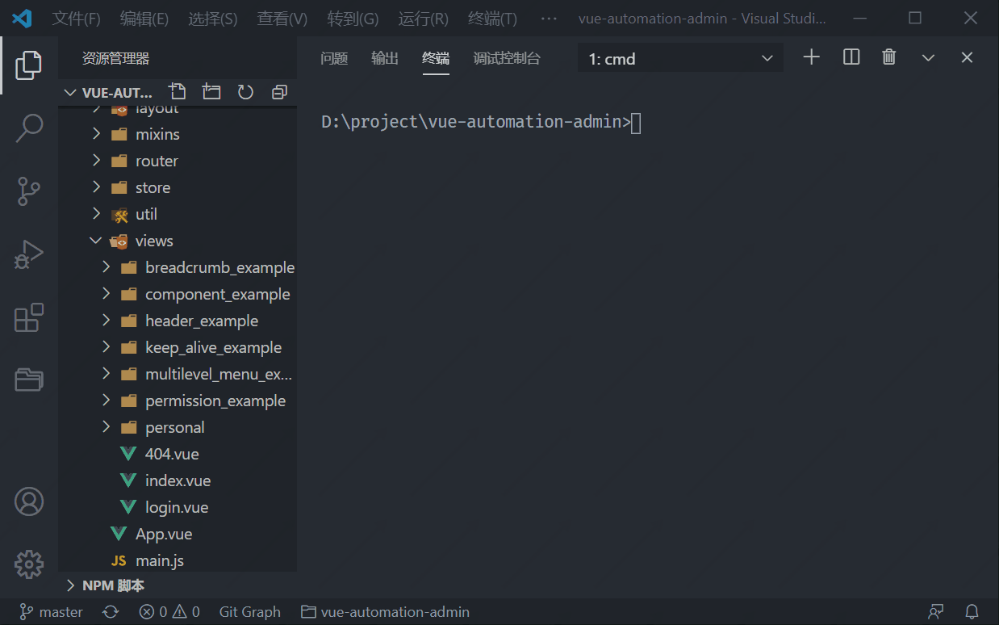

# 快速创建文件

借助 [plop](https://www.npmjs.com/package/plop) 的能力，实现只需通过一句 `yarn new` 命令，即可调用不同模版自动创建标准模块、页面、组件和全局状态的文件。

**强烈建议**通过 `yarn new` 进行各个文件的创建，尤其是标准模块的创建，能够确保在多人协同开发时，不同模块的整体风格统一。

如果现有提供的 plop 模版不能满足开发要求，也可以自行修改或创建模版，模版目录为 `./plop-templates/` ，如果新增模版，记得在项目根目录 `plopfile.js` 里进行引用。